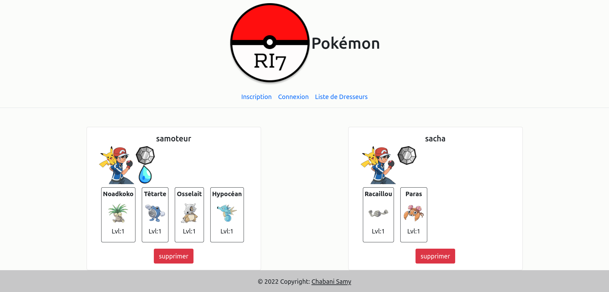

# Pokemon CRUD Project


This educational project was completed during my training. It is my first CRUD (Create, Read, Update, Delete) application built using Node.js, and it utilizes a NoSQL database, MongoDB. The project involves creating a Pokemon trainer account, adding Pokemon to your collection, earning badges for every +2 Pokemon collected, and using 10 attribute points to enhance your Pokemon's attack, speed, or defense. You can add, remove, or modify a Pokemon's attributes.



## How to Launch the Project

To run this project on your computer, follow these steps:

1. Clone the project repository to your local machine.

2. Run `npm install` to install the necessary dependencies.

3. Start the application using `npm start`.

4. Access the application via [http://localhost:8081/connexionUser/652a8cfc18ec63a74fdd4402](http://localhost:8081/connexionUser/652a8cfc18ec63a74fdd4402).

## Setting Up MongoDB

Before launching the project, ensure you have MongoDB installed. If not, you can download it from [MongoDB's official website](https://www.mongodb.com/fr-fr). You will also need to create a MongoDB database.

After setting up MongoDB, modify the `config.js` file as follows:

```javascript
export class Config {
    static dbUserName = "yourUserName";
    static dbPassword = "yourDbPassword";
    static bdClusterName = "yourDbCluster";
    static bdNameDatabase = "dbName(pokemon)";
}
